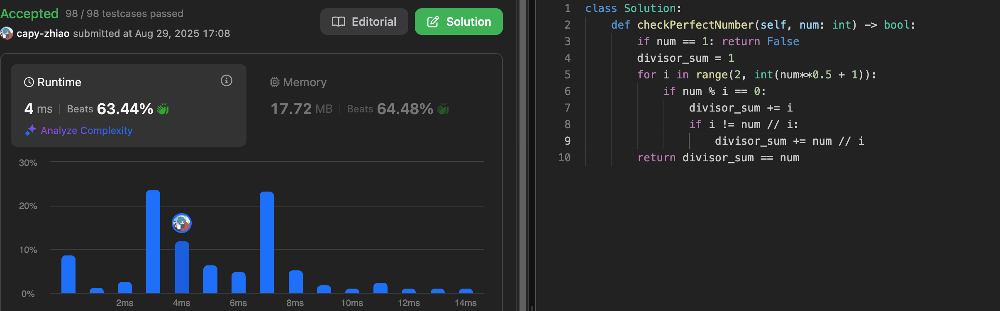
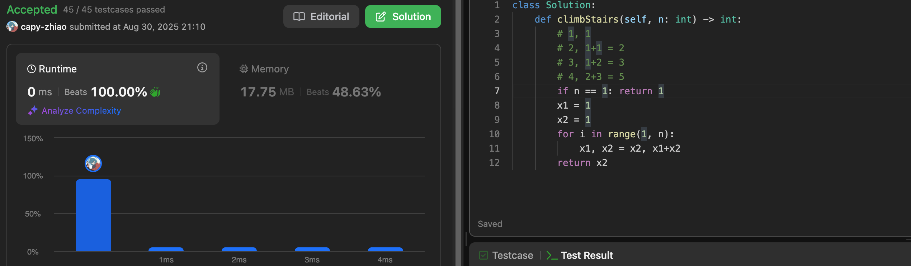
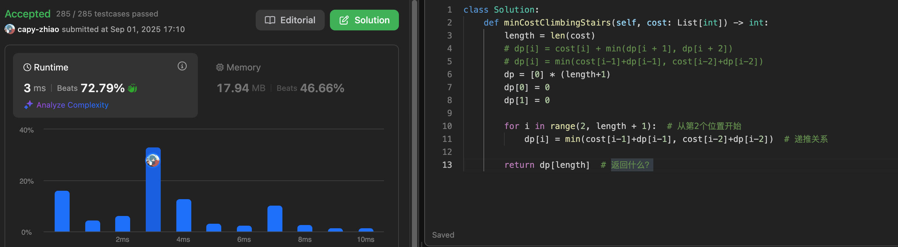
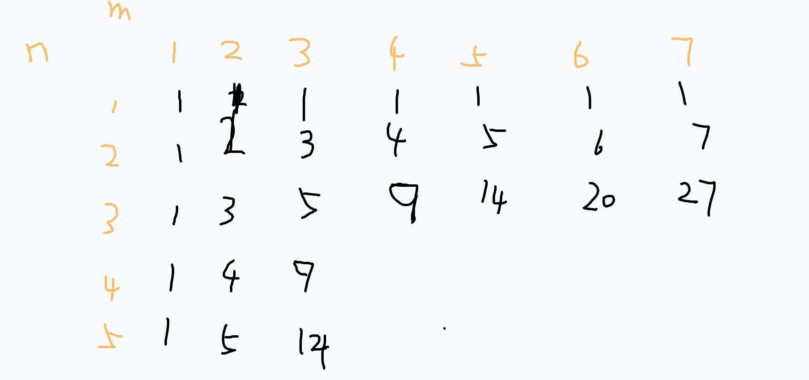
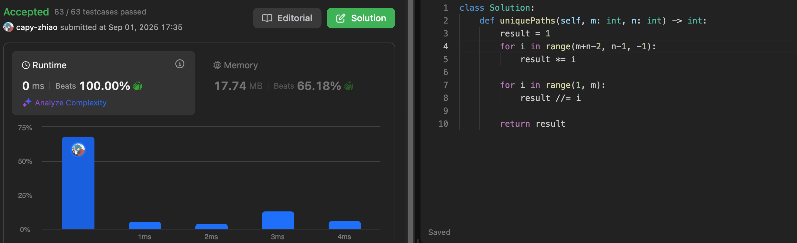
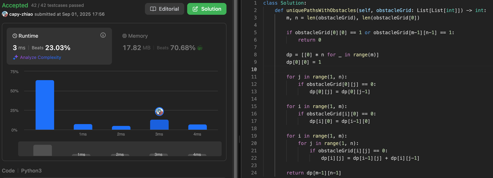
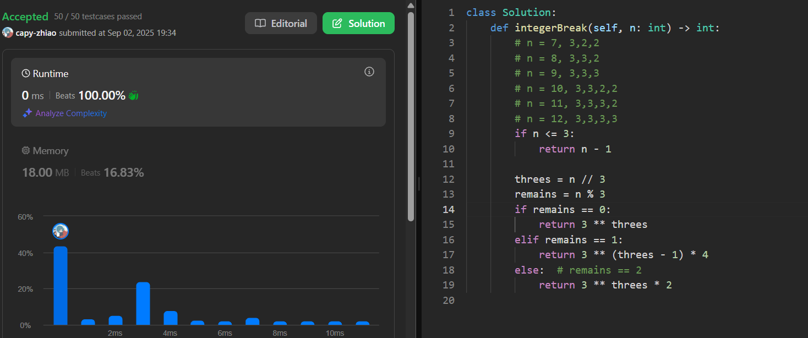
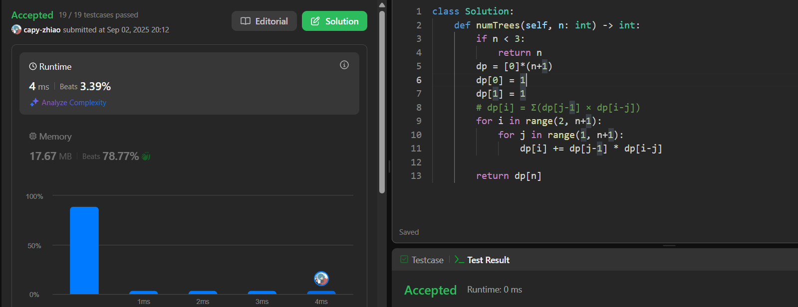

# 动态规划基础

例如：有N件物品和一个最多能背重量为W 的背包。第i件物品的重量是weight[i]，得到的价值是value[i] 。**每件物品只能用一次**，求解将哪些物品装入背包里物品价值总和最大。

动态规划中dp[j]是由dp[j]-weight[i]]推导出来的，然后取max(dp[j], dp[j] - weight[i]] + value[i])。

但如果是贪心呢，每次拿物品选一个最大的或者最小的就完事了，和上一个状态没有关系。

1. 确定dp数组（dp table）以及下标的含义
2. 确定递推公式
3. dp数组如何初始化
4. 确定遍历顺序
5. 举例推导dp数组

## 507 [Perfect Number](https://leetcode.com/problems/perfect-number/)

If i is the factor of num, then num/i is also a factor
Just traverse to √num and find a pair of factors each time

## 70 [Climbing Stairs](https://leetcode.com/problems/climbing-stairs/)

Fn = fn-1 + fn-2

## 746 [Min Cost Climbing Stairs](https://leetcode.com/problems/min-cost-climbing-stairs/)

Find Recurrence Relation:dp[i] = min(cost[i-1]+dp[i-1], cost[i-2]+dp[i-2])

## 62 [Unique Paths](https://leetcode.com/problems/unique-paths/)

thinking:

the formula is: C(m+n-2, m-1), C(n,k) = n! / (k! × (n-k)!) = C(n,k) = (n × (n-1) × (n-2) × ... × (n-k+1)) / (1 × 2 × 3 × ... × k)

C(m+n-2, m-1) = [(m+n-2) × (m+n-3) × ... × n] / [1 × 2 × 3 × ... × (m-1)]

so solution:

## 63 [Unique Paths II](https://leetcode.com/problems/unique-paths-ii/)

Where there are obstacles (1), the number of paths is 0
Where there are no obstacles (0), the number of paths = number of paths above + number of paths on the left
If the starting point is an obstacle, return directly to 0.

## 343 [Integer Break](https://leetcode.com/problems/integer-break/)

emmmm

## 96 [Unique Binary Search Trees](https://leetcode.com/problems/unique-binary-search-trees/)

dp[i] = Σ(dp[j-1] × dp[i-j])  j is from 1 to n

`j` is the destination of root

`dp[j-1]` is the number of left-tree

`dp[i-j]` is the number of right-tree

# 背包问题

# 打家劫舍

# 股票

#  子序列

