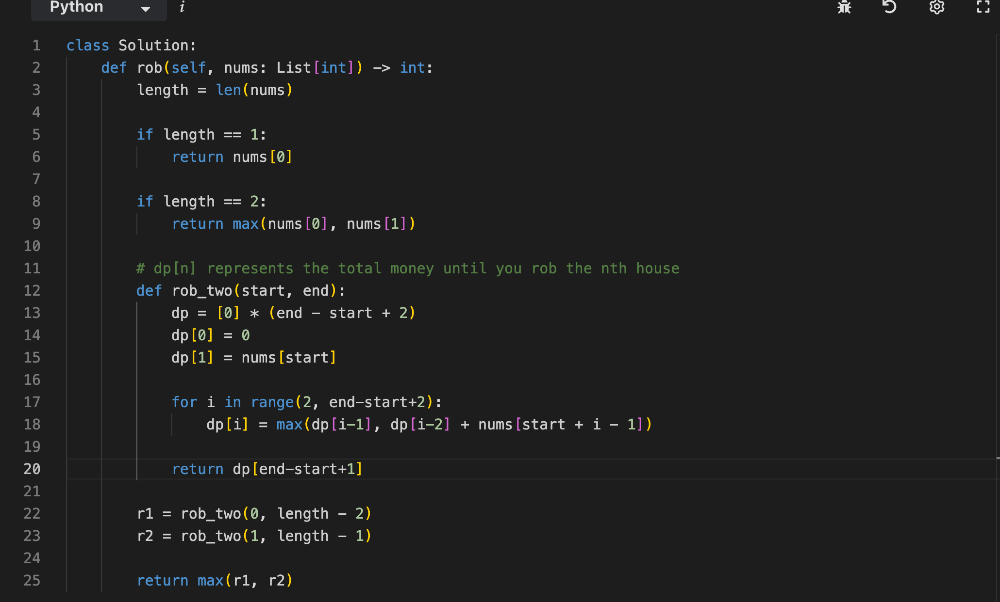

# 动态规划基础

例如：有N件物品和一个最多能背重量为W 的背包。第i件物品的重量是weight[i]，得到的价值是value[i] 。**每件物品只能用一次**，求解将哪些物品装入背包里物品价值总和最大。

动态规划中dp[j]是由dp[j]-weight[i]]推导出来的，然后取max(dp[j], dp[j] - weight[i]] + value[i])。

但如果是贪心呢，每次拿物品选一个最大的或者最小的就完事了，和上一个状态没有关系。

1. 确定dp数组（dp table）以及下标的含义
2. 确定递推公式
3. dp数组如何初始化
4. 确定遍历顺序
5. 举例推导dp数组

## 507 [Perfect Number](https://leetcode.com/problems/perfect-number/)

If i is the factor of num, then num/i is also a factor
Just traverse to √num and find a pair of factors each time


## 70 [Climbing Stairs](https://leetcode.com/problems/climbing-stairs/)

Fn = fn-1 + fn-2


## 746 [Min Cost Climbing Stairs](https://leetcode.com/problems/min-cost-climbing-stairs/)

Find Recurrence Relation:dp[i] = min(cost[i-1]+dp[i-1], cost[i-2]+dp[i-2])


## 62 [Unique Paths](https://leetcode.com/problems/unique-paths/)

thinking:


the formula is: C(m+n-2, m-1), C(n,k) = n! / (k! × (n-k)!) = C(n,k) = (n × (n-1) × (n-2) × ... × (n-k+1)) / (1 × 2 × 3 × ... × k)

C(m+n-2, m-1) = [(m+n-2) × (m+n-3) × ... × n] / [1 × 2 × 3 × ... × (m-1)]

so solution:


## 63 [Unique Paths II](https://leetcode.com/problems/unique-paths-ii/)

Where there are obstacles (1), the number of paths is 0
Where there are no obstacles (0), the number of paths = number of paths above + number of paths on the left
If the starting point is an obstacle, return directly to 0.


## 343 [Integer Break](https://leetcode.com/problems/integer-break/)

emmmm


## 96 [Unique Binary Search Trees](https://leetcode.com/problems/unique-binary-search-trees/)

dp[i] = Σ(dp[j-1] × dp[i-j])  j is from 1 to n

`j` is the destination of root

`dp[j-1]` is the number of left-tree

`dp[i-j]` is the number of right-tree


# 背包问题


https://github.com/youngyangyang04/leetcode-master/blob/master/problems/%E8%83%8C%E5%8C%85%E7%90%86%E8%AE%BA%E5%9F%BA%E7%A1%8001%E8%83%8C%E5%8C%85-1.md

## 01背包

### 416 [Partition Equal Subset Sum](https://leetcode.com/problems/partition-equal-subset-sum/)

**DP思路：**

```
dp[i] = 能否凑出和为 i 的子集
```

**状态转移：** 对每个数字 `num`，更新所有可能的和：

```
如果之前能凑出 dp[i-num]，那么现在就能凑出 dp[i]
```


### 1049 [Last Stone Weight II](https://leetcode.com/problems/last-stone-weight-ii/)

it can be splited into 2 parts to be divided.


### 494 [Target Sum](https://leetcode.com/problems/target-sum/)

```
nums = [1,1,1,1,1], target = 3
```

```
dp[j] = 和为 j 的方案数
 初始化：dp[0] = 1
```

逐个加 1：

- 第 1 个 1：
  - `dp[1] += dp[0]` → `dp[1] = 1`
- 第 2 个 1：
  - `dp[1] += dp[0]` → `dp[1] = 2`
  - `dp[2] += dp[1]` → `dp[2] = 1`
- 第 3 个 1：
  - 更新后 `dp[1] = 3, dp[2] = 3, dp[3] = 1`
- 第 4 个 1：
  - 更新后 `dp[1] = 4, dp[2] = 6, dp[3] = 4, dp[4] = 1`
- 第 5 个 1：
  - 更新后 `dp[1] = 5, dp[2] = 10, dp[3] = 10, dp[4] = 5, dp[5] = 1`

最终：
 `dp[4] = 5`


## 完全背包

### 518 [Coin Change II](https://leetcode.com/problems/coin-change-ii/)

dp[x] += dp[x - c] 

假设我们决定用一枚硬币 `c` 来组成 `x`，那剩下的金额就是 `x - c`。
 也就是说，**每一种凑成 `x - c` 的方法，都能在最后加上一枚 `c`，从而形成一种新的凑成 `x` 的方法**。

`dp[x]` 里原来已经有一些方法（可能是用别的硬币凑的）。

现在我们再加上「从 `x-c` 转移过来的那些方法」，就得到新的总数。


### 377 [Combination Sum IV](https://leetcode.com/problems/combination-sum-iv/)


### 322


### 279


### 139


# 打家劫舍


# 股票


#  子序列


# DP problem from NeetCode

## [Climbing Stairs](https://neetcode.io/problems/climbing-stairs?list=neetcode150)


## [Min Cost Climbing Stairs](https://neetcode.io/problems/min-cost-climbing-stairs?list=neetcode150)


## [House Robber][https://neetcode.io/problems/house-robber?list=neetcode150]


## [House Robber II](https://neetcode.io/problems/house-robber-ii?list=neetcode150)


