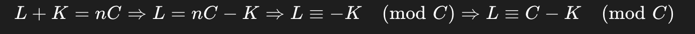

# easy [203. Remove Linked List Elements](https://leetcode.com/problems/remove-linked-list-elements/)

## description

Given the `head` of a linked list and an integer `val`, remove all the nodes of the linked list that has `Node.val == val`, and return *the new head*.

**Example 1:**


```
Input: head = [1,2,6,3,4,5,6], val = 6
Output: [1,2,3,4,5]
```

**Example 2:**

```
Input: head = [], val = 1
Output: []
```

**Example 3:**

```
Input: head = [7,7,7,7], val = 7
Output: []
```

## solution

```python
# Definition for singly-linked list.
# class ListNode:
#     def __init__(self, val=0, next=None):
#         self.val = val
#         self.next = next
class Solution:
    def removeElements(self, head: Optional[ListNode], val: int) -> Optional[ListNode]:
        root = ListNode(0)
        root.next = head
        tmp = root
        while tmp.next:
            if tmp.next.val == val:
                tmp.next = tmp.next.next
            else:
                tmp = tmp.next
        return root.next

```

# Med [707. Design Linked List](https://leetcode.com/problems/design-linked-list/)

## description

Design your implementation of the linked list. You can choose to use a singly or doubly linked list.
A node in a singly linked list should have two attributes: `val` and `next`. `val` is the value of the current node, and `next` is a pointer/reference to the next node.
If you want to use the doubly linked list, you will need one more attribute `prev` to indicate the previous node in the linked list. Assume all nodes in the linked list are **0-indexed**.

Implement the `MyLinkedList` class:

- `MyLinkedList()` Initializes the `MyLinkedList` object.
- `int get(int index)` Get the value of the `indexth` node in the linked list. If the index is invalid, return `-1`.
- `void addAtHead(int val)` Add a node of value `val` before the first element of the linked list. After the insertion, the new node will be the first node of the linked list.
- `void addAtTail(int val)` Append a node of value `val` as the last element of the linked list.
- `void addAtIndex(int index, int val)` Add a node of value `val` before the `indexth` node in the linked list. If `index` equals the length of the linked list, the node will be appended to the end of the linked list. If `index` is greater than the length, the node **will not be inserted**.
- `void deleteAtIndex(int index)` Delete the `indexth` node in the linked list, if the index is valid. 

**Example 1:**

```
Input
["MyLinkedList", "addAtHead", "addAtTail", "addAtIndex", "get", "deleteAtIndex", "get"]
[[], [1], [3], [1, 2], [1], [1], [1]]
Output
[null, null, null, null, 2, null, 3]

Explanation
MyLinkedList myLinkedList = new MyLinkedList();
myLinkedList.addAtHead(1);
myLinkedList.addAtTail(3);
myLinkedList.addAtIndex(1, 2);    // linked list becomes 1->2->3
myLinkedList.get(1);              // return 2
myLinkedList.deleteAtIndex(1);    // now the linked list is 1->3
myLinkedList.get(1);              // return 3
```

## solution

```python
class ListNode:
    def __init__(self, val=0, next=None):
        self.val = val
        self.next = next

class MyLinkedList:

    def __init__(self):
        self.head = None
        self.size = 0

    def get(self, index: int) -> int:
        if index < 0 or index >= self.size:
            return -1
        cur = self.head
        for _ in range(index):
            cur = cur.next
        return cur.val

    def addAtHead(self, val: int) -> None:
        newnode = ListNode(val)
        newnode.next = self.head
        self.head = newnode
        self.size += 1

    def addAtTail(self, val: int) -> None:
        newnode = ListNode(val)
        if self.head is None:
            self.head = newnode
        else:
            cur = self.head
            while cur.next:
                cur = cur.next
            cur.next = newnode
        self.size += 1

    def addAtIndex(self, index: int, val: int) -> None:
        if index < 0 or index > self.size:
            return
        if index == 0:
            self.addAtHead(val)
        elif index == self.size:
            self.addAtTail(val)
        else:
            cur = self.head
            for _ in range(index - 1):
                cur = cur.next
            newnode = ListNode(val)
            newnode.next = cur.next
            cur.next = newnode
            self.size += 1

    def deleteAtIndex(self, index: int) -> None:
        if index < 0 or index >= self.size:
            return
        if index == 0:
            self.head = self.head.next
        else:
            cur = self.head
            for _ in range(index - 1):
                cur = cur.next
            cur.next = cur.next.next
        self.size -= 1

```


## After

天才:

```python
class MyLinkedList:

    def __init__(self):
        self.arr = []

    def get(self, index: int) -> int:
        if index >= len(self.arr): return -1

        return self.arr[index]

    def addAtHead(self, val: int) -> None:
        self.arr.insert(0, val)

    def addAtTail(self, val: int) -> None:
        self.arr.append(val)

    def addAtIndex(self, index: int, val: int) -> None:
        if index > len(self.arr): return
        self.arr.insert(index, val)

    def deleteAtIndex(self, index: int) -> None:
        if index >= len(self.arr): return
        self.arr.pop(index)
```


# easy [206. Reverse Linked List](https://leetcode.com/problems/reverse-linked-list/)

## description

Given the `head` of a singly linked list, reverse the list, and return *the reversed list*.

**Example 1:**


```
Input: head = [1,2,3,4,5]
Output: [5,4,3,2,1]
```

**Example 2:**


```
Input: head = [1,2]
Output: [2,1]
```

**Example 3:**

```
Input: head = []
Output: []
```

## solution

```python
# Definition for singly-linked list.
# class ListNode:
#     def __init__(self, val=0, next=None):
#         self.val = val
#         self.next = next

class Solution:
    def addathead(self, root, val):
        tmp = ListNode(val)
        tmp.next = root
        return tmp

    def reverseList(self, head: Optional[ListNode]) -> Optional[ListNode]:
        root = None
        cur = head
        while cur:
            root = self.addathead(root, cur.val)
            cur = cur.next   
        return root
```


## After

0ms:

```
递归做的
```

# med [24. Swap Nodes in Pairs](https://leetcode.com/problems/swap-nodes-in-pairs/)

## description

Given a linked list, swap every two adjacent nodes and return its head. You must solve the problem without modifying the values in the list's nodes (i.e., only nodes themselves may be changed.)

**Example 1:**

**Input:** head = [1,2,3,4]

**Output:** [2,1,4,3]

**Explanation:**


**Example 2:**

**Input:** head = []

**Output:** []

**Example 3:**

**Input:** head = [1]

**Output:** [1]

**Example 4:**

**Input:** head = [1,2,3]

**Output:** [2,1,3]

## solution

要设置一个虚拟节点方便后面返回和交换

```python
# Definition for singly-linked list.
# class ListNode:
#     def __init__(self, val=0, next=None):
#         self.val = val
#         self.next = next
class Solution:        
    def swapPairs(self, head: Optional[ListNode]) -> Optional[ListNode]:
        dummy = ListNode(0, head)
        prev = dummy
        cur = head

        while cur and cur.next:
            tmp = cur.next.next
            prev.next = cur.next
            cur.next = tmp
            prev.next.next = cur

            prev = cur
            cur = cur.next
        return dummy.next
```

# med [19. Remove Nth Node From End of List](https://leetcode.com/problems/remove-nth-node-from-end-of-list/)

## description

Given the `head` of a linked list, remove the `nth` node from the end of the list and return its head.

**Example 1:**


```
Input: head = [1,2,3,4,5], n = 2
Output: [1,2,3,5]
```

**Example 2:**

```
Input: head = [1], n = 1
Output: []
```

**Example 3:**

```
Input: head = [1,2], n = 1
Output: [1]
```

## solution

虚拟头节点很重要!!!

```python
# Definition for singly-linked list.
# class ListNode:
#     def __init__(self, val=0, next=None):
#         self.val = val
#         self.next = next
class Solution:
    def removeNthFromEnd(self, head: Optional[ListNode], n: int) -> Optional[ListNode]:
        dummy = ListNode(0, head)

        # size
        cur = head
        size = 0

        while cur:
            size += 1
            cur = cur.next

        # cal
        cur2 = dummy
        index = size - n
        for _ in range(index):
            cur2 = cur2.next
        cur2.next = cur2.next.next


        return dummy.next

```

# med [142. Linked List Cycle II](https://leetcode.com/problems/linked-list-cycle-ii/)

## decription

Given the `head` of a linked list, return *the node where the cycle begins. If there is no cycle, return* `null`.

There is a cycle in a linked list if there is some node in the list that can be reached again by continuously following the `next` pointer. Internally, `pos` is used to denote the index of the node that tail's `next` pointer is connected to (**0-indexed**). It is `-1` if there is no cycle. **Note that** `pos` **is not passed as a parameter**.

**Do not modify** the linked list. 

**Example 1:**


```
Input: head = [3,2,0,-4], pos = 1
Output: tail connects to node index 1
Explanation: There is a cycle in the linked list, where tail connects to the second node.
```

**Example 2:**


```
Input: head = [1,2], pos = 0
Output: tail connects to node index 0
Explanation: There is a cycle in the linked list, where tail connects to the first node.
```

**Example 3:**


```
Input: head = [1], pos = -1
Output: no cycle
Explanation: There is no cycle in the linked list.
```

## solution

```python
# Definition for singly-linked list.
# class ListNode:
#     def __init__(self, x):
#         self.val = x
#         self.next = None

class Solution:
    def detectCycle(self, head: Optional[ListNode]) -> Optional[ListNode]:
        # 2 pointer
        slow = head
        fast = head

        # edge
        if not head or not head.next:
            return None
        
        # fine None or cycle
        while fast and fast.next:
            fast = fast.next.next
            slow = slow.next
            if slow == fast:
                break
        
        # Judgment
        if not fast or not fast.next:
            return None
        
        slow = head
        while slow != fast:
            slow = slow.next
            fast = fast.next

        return slow
```

## after

快慢指针

### 🌐 情景设定：

链表结构如下（带环）：

```
a → b → c → e → d → f → g
           ↑             ↓
           ← ← ← ← ← ← ←
```

- `L` 是从 `head` 到入环点 `c` 的距离：`L = 2`（a → b → c）
- `C` 是环的长度：`C = 5`（c → e → d → f → g → c）
- `K` 是从入环点 `c` 开始，`fast` 指针在环中走的距离，直到第一次与 `slow` 相遇
- `n` 是 `fast` 在环中走的圈数（可能是 1 圈，也可能是更多）

### 🧠 快慢指针分析：

- 初始时：

  - `slow` 每次走 1 步
  - `fast` 每次走 2 步

- 当两者相遇时，肯定是在**环中**。

- 设从 `head` 到相遇点的总长度为：

  ```
  slow 走的步数 = L + K
  fast 走的步数 = L + K + n*C（多走了 n 圈）
  ```

因为 `fast` 速度是 `slow` 的两倍：

```
2(L + K) = L + K + n*C
```

解这个方程：

```
L + K = n * C
```

根据公式：



所以两者会在入环点相遇！

这意味着：

> 从 `head` 走到入环点的距离 `L`，等于从相遇点再走 `C - K` 步，也就是刚好到达入环点。
