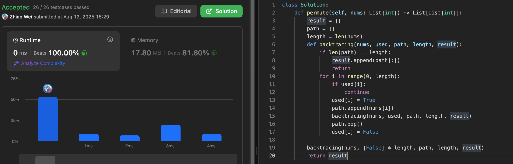
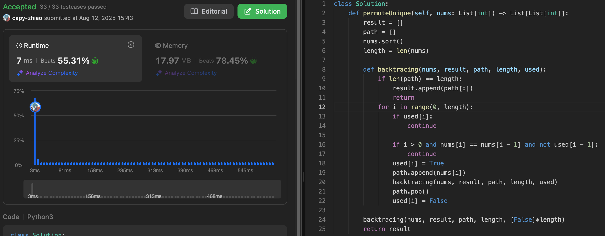

# intro

回溯法其实就是暴力查找

### 回溯法解决的问题

回溯法，一般可以解决如下几种问题：

- 组合问题：N个数里面按一定规则找出k个数的集合
- 切割问题：一个字符串按一定规则有几种切割方式
- 子集问题：一个N个数的集合里有多少符合条件的子集
- 排列问题：N个数按一定规则全排列，有几种排列方式
- 棋盘问题：N皇后，解数独等等

在上面我们提到了，回溯法一般是在集合中递归搜索，集合的大小构成了树的宽度，递归的深度构成的树的深度。

如图：

[](https://camo.githubusercontent.com/328809c1183b5aa1d1a01628de89ce4e55f97328307746a8eb9b74db7a318d9b/68747470733a2f2f66696c65312e6b616d61636f6465722e636f6d2f692f616c676f2f32303231303133303137333633313137342e706e67)

注意图中，我特意举例集合大小和孩子的数量是相等的！

# 组合

## 77[Combinations](https://leetcode.com/problems/combinations/)


## 17[Letter Combinations of a Phone Number](https://leetcode.com/problems/letter-combinations-of-a-phone-number/)


## 39[Combination Sum](https://leetcode.com/problems/combination-sum/)


## 40[Combination Sum II](https://leetcode.com/problems/combination-sum-ii/)


## 216[Combination Sum III](https://leetcode.com/problems/combination-sum-iii/)


# 分割

## 131[Palindrome Partitioning](https://leetcode.com/problems/palindrome-partitioning/)


## 93[Restore IP Addresses](https://leetcode.com/problems/restore-ip-addresses/)

| 步骤     | 内容                           |
| -------- | ------------------------------ |
| 剪枝     | 长度不在 4~12 之间直接返回空   |
| 回溯     | 枚举每段 1~3 个字符            |
| 判断合法 | 每段不能大于 255，不能有前导零 |
| 终止条件 | 切满 4 段并且用完所有字符      |


# 子集

## 78[Subsets](https://leetcode.com/problems/subsets/)


## 90[Subsets II](https://leetcode.com/problems/subsets-ii/)


# 排列

## 46[Permutations](https://leetcode.com/problems/permutations/)

At each recursion level, it loops through all unused numbers.

It **adds one number** to the current path (`path.append()`), marks it as used, and goes deeper.

When the path reaches the full length, it’s added to the result.

Then it **backtracks**: removes the last number (`path.pop()`), marks it unused, and continues the loop to try the next number.



## 47[Permutations II](https://leetcode.com/problems/permutations-ii/)

nums.sort()!!!!!!!!

if i > 0 and nums[i] == nums[i - 1] and not used[i - 1] !!!!!



# 棋盘

## 51[N-Queens](https://leetcode.com/problems/n-queens/)

皇后不能出现在：

1. 同一行 ❌

1. 每一行只能放一个皇后。
2. 可以用**回溯每行放置**的方式，从第 0 行递归放到第 n-1 行。

2. 同一列 ❌

- 如果你在列 j 放了一个皇后，就不能在其他行放在列 j。
- 用一个 `set` 或布尔数组来记录列是否被占用。

3. 同一主对角线 ❌（↘︎）

- 所有在同一主对角线上的格子满足：`row - col` 相同
- 用一个 `set` 来记录 `row - col` 是否已被占用

4. 同一副对角线 ❌（↙︎）

- 所有在同一副对角线上的格子满足：`row + col` 相同
- 同样用一个 `set` 来记录 `row + col` 是否被占用

```python
class Solution:
    def isValid(self, row: int, col: int, board: List[str]) -> bool:
        for i in range(row):
            if board[i][col] == 'Q':
                return False
        
        i, j = row - 1, col - 1# 左上
        while i >= 0 and j >= 0:
            if board[i][j] == 'Q':
                return False 
            i -= 1
            j -= 1

        i, j = row - 1, col + 1
        while i >= 0 and j < len(board):
            if board[i][j] == 'Q':
                return False  # 右上
            i -= 1
            j += 1
        
        return True

    def backtracing(self, n: int, row: int, board: List[str], result: List[List[str]]) -> None:
        if row == n:
            result.append(board[:])
            return

        for col in range(n):
            if self.isValid(row, col, board):
                board[row] = board[row][:col] + 'Q' + board[row][col+1:]
                self.backtracing(n, row + 1, board, result)
                board[row] = board[row][:col] + '.' + board[row][col+1:]

    def solveNQueens(self, n: int) -> List[List[str]]:
        result = []
        board = ['.' * n for _ in range(n)]

        self.backtracing(n, 0, board, result)
        return [[''.join(row) for row in solution] for solution in result]

            
```


## 37


# remain

## 491


## 332

