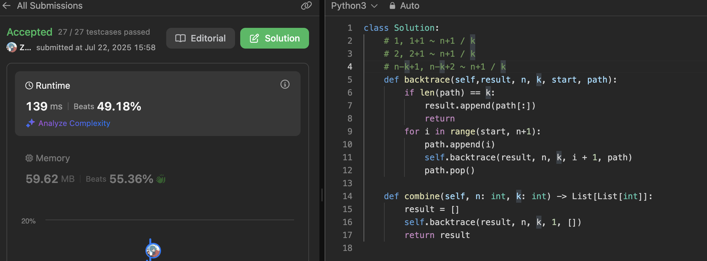
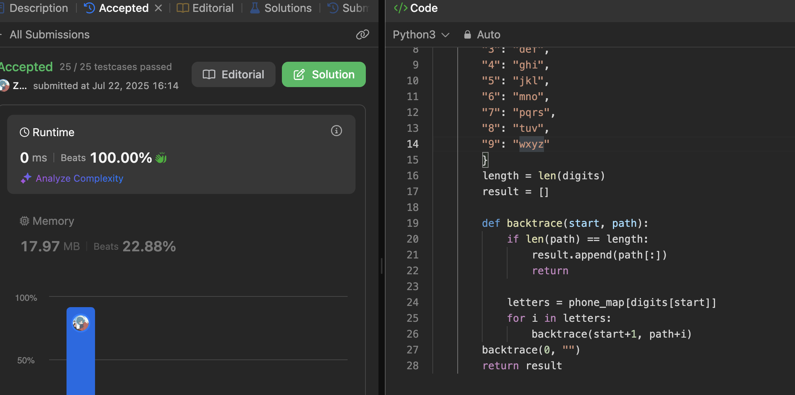
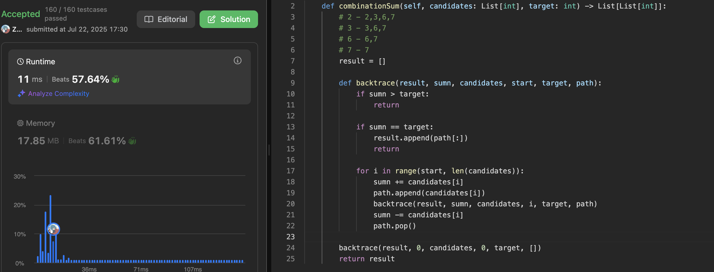

# intro

回溯法其实就是暴力查找

### 回溯法解决的问题

回溯法，一般可以解决如下几种问题：

- 组合问题：N个数里面按一定规则找出k个数的集合
- 切割问题：一个字符串按一定规则有几种切割方式
- 子集问题：一个N个数的集合里有多少符合条件的子集
- 排列问题：N个数按一定规则全排列，有几种排列方式
- 棋盘问题：N皇后，解数独等等

在上面我们提到了，回溯法一般是在集合中递归搜索，集合的大小构成了树的宽度，递归的深度构成的树的深度。

如图：

注意图中，我特意举例集合大小和孩子的数量是相等的！

# 组合

## 77[Combinations](https://leetcode.com/problems/combinations/)

## 17[Letter Combinations of a Phone Number](https://leetcode.com/problems/letter-combinations-of-a-phone-number/)

## 39[Combination Sum](https://leetcode.com/problems/combination-sum/)

## 40

## 216

# 分割

## 131

## 93

# 子集

## 78

## 90

# 排列

## 46

## 47

# 棋盘

## 51

## 37

# remain

## 491

## 332

