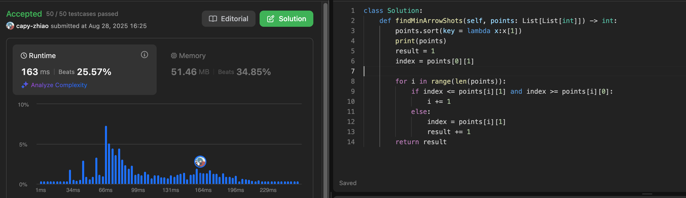

# Greedy Algorithm

The only difficulty lies in how to derive the global optimum from local optima.
 A greedy algorithm is generally divided into the following four steps:

1. Decompose the problem into several subproblems
2. Identify an appropriate greedy strategy
3. Solve each subproblem optimally
4. Combine the local optimal solutions into a global optimal solution


## 455 [Assign Cookies](https://leetcode.com/problems/assign-cookies/)


## 376[Wiggle Subsequence](https://leetcode.com/problems/wiggle-subsequence/)

When the sign of `diff` is different from the previously recorded sign (from up → down or down → up), increase the count by 1 and update the "previous sign".

The initial length is at least 1; when the first non-zero difference appears, set the length to 2.


## 53[Maximum Subarray](https://leetcode.com/problems/maximum-subarray/)

keep two variables:

- `result`: the current running subarray sum
- `best`: the maximum subarray sum

For each number in `nums`:

1. Add it to `result`.
2. Update `best` if `result` is larger.
3. If `result` becomes negative, reset it to `0` (start a new subarray).

At the end, `best` is the answer.


## 122[Best Time to Buy and Sell Stock II](https://leetcode.com/problems/best-time-to-buy-and-sell-stock-ii/)

Easy to write if you know the principle.
 As long as `prices[i] > prices[i-1]`, add the difference `prices[i] - prices[i-1]` to the profit.


## 55[Jump Game](https://leetcode.com/problems/jump-game/)

```python
nums = [2,3,1,1,4]`
Begin: `farthest = 0
```

- **i = 0**: you can jump to `0 + nums[0] = 2`, so update `farthest = 2`.
- **i = 1**: now `i = 1 <= farthest = 2`, so index 1 is reachable; from 1 you can jump to `1 + 3 = 4`, update `farthest = 4`.
- **i = 2**: now `i = 2 <= farthest = 4`, still reachable; from 2 you can only jump to 3, which is not farther than 4, so `farthest` stays the same.
- Finally, `farthest = 4 >= len(nums) - 1`, so the last index is reachable → return **true**.


## 45[Jump Game II](https://leetcode.com/problems/jump-game-ii/)

Example (`[2,3,1,1,4]`):

- Initial: `steps = 0, end = 0, farthest = 0`
- **i = 0**: `farthest = max(0, 0+2) = 2`; since `i == end`, we make a jump → `steps = 1, end = 2`
- **i = 1**: `farthest = max(2, 1+3) = 4`
- **i = 2**: `farthest = max(4, 2+1) = 4`; since `i == end`, we make another jump → `steps = 2, end = 4`
- Done. Answer = **2**.


## 1005[Maximize Sum Of Array After K Negations](https://leetcode.com/problems/maximize-sum-of-array-after-k-negations/)

For the first part, we should sort the array and flip all negative numbers to positive.

For the second part, if there are still some operations left, then:

- if `k mod 2 is 0`, flipping has no influence on the result,
- otherwise, we should sort the array again and flip the element with the smallest absolute value.


## 134[Gas Station](https://leetcode.com/problems/gas-station/)

First, we should check whether the total sum of gas is greater than the total sum of cost. If not, return -1.
 Then, since there is a unique solution, if the sum of one segment is less than 0, the sum of the other segment must be greater than 0, so we must start from the first station of the other segment.


## hard 135[Candy](https://leetcode.com/problems/candy/)

If `ratings[i] > ratings[i - 1]`, child *i* must receive more candies than child *i - 1*, so we set
 `candy[i] = candy[i - 1] + 1`.

If `ratings[i] > ratings[i + 1]`, then child *i* needs to have more candies than child *i + 1*. At this point, the candy count for child *i* should be the maximum between its current value (from the left-to-right pass) and `candy[i + 1] + 1` (from the right-to-left pass).

By always taking the maximum, we satisfy the local condition (higher-rated child has more candies than neighbors). As a result, the global condition is guaranteed: every higher-rated child among adjacent pairs receives more candies.


## 860[Lemonade Change](https://leetcode.com/problems/lemonade-change/)

use five and ten to solute


## 406[Queue Reconstruction by Height](https://leetcode.com/problems/queue-reconstruction-by-height/)

## Queue Reconstruction - Core Approach

### Key Insight

Each person `[height, count]` where count = number of people in front with height ≥ current person's height

### Algorithm Strategy

1. Greedy Strategy: Process tall people first

   - Reason: Short people won't affect tall people's count values
   - When heights are equal, process smaller count first

2. Sorting

   ```
   (-height, count)
   ```

   - Height in descending order, count in ascending order

3. Insertion

   ```
   result.insert(count, person)
   ```

   - Each person's insertion position = their count value
   - Later people will "push" earlier people backward


## 452[Minimum Number of Arrows to Burst Balloons](https://leetcode.com/problems/minimum-number-of-arrows-to-burst-balloons/)

**Sort by end position** - Balloons ending earliest are most "urgent"

**Always shoot at the end of earliest-ending balloon** - This can hit more balloons

**Skip hit balloons, repeat the process**




## 435[Non-overlapping Intervals](https://leetcode.com/problems/non-overlapping-intervals/)

**Keep intervals that end earliest** - they leave more room for future intervals


## 763


## 56


## 738[Monotone Increasing Digits](https://leetcode.com/problems/monotone-increasing-digits/)

```python
Convert the integer to a string
Traverse the string from right to left
If the current character is smaller than the previous one, 
	it means we need to modify the previous character
Decrease the previous character by 1
Set all characters after the modified position to 9
Convert the list back to a string, then convert the string to an integer and return it
```


## 

## 968


## 
